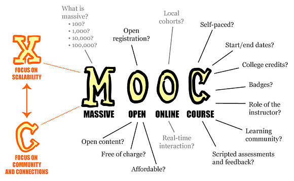
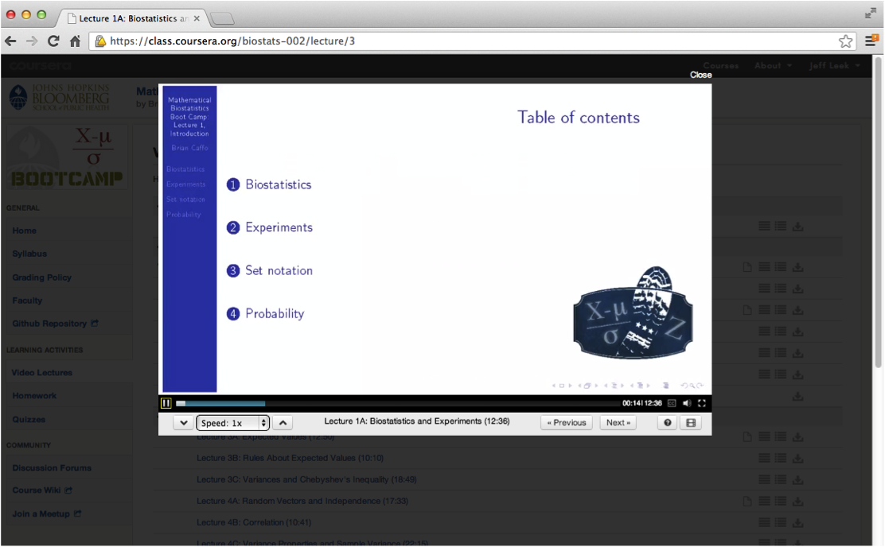
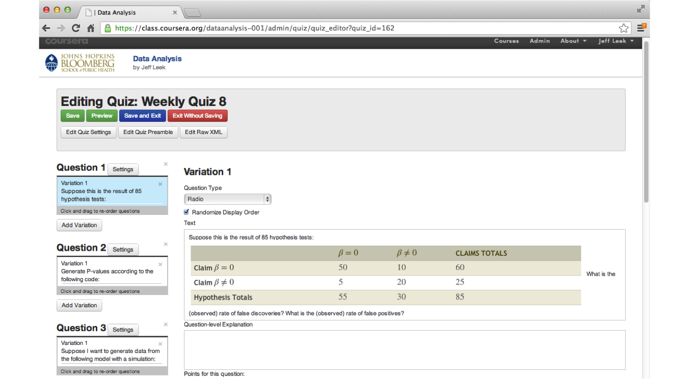
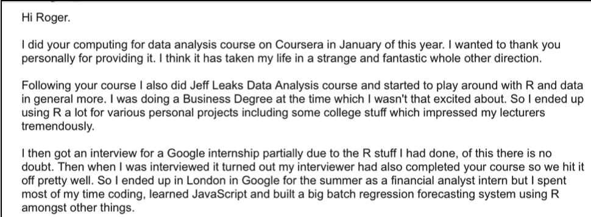
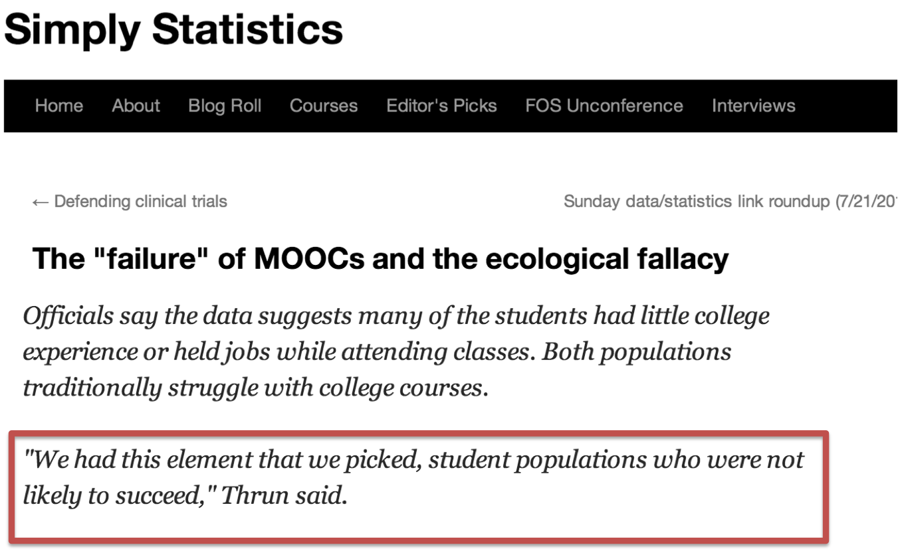

## Alternative title

 How Brian Caffo talked me into a multi-year unpaid Coursera internship. 

--- &twocol w1:50% w2:50%
## What I really do for a living

*** =left

* Develop technologies
* Population level inference
* Identifying replicabile features
* Basic machine learning
* Distributing results (software)

*** =right

---
## MOOCs 

Primary characteristics are open access, low cost, scalable, online 

### (every letter is negotiable, from Wikipedia citing Mathieu Plorde)

---

## How I got into teaching the masses

* __Previously__ : Youtube lectures and “flipping” the classroom.
* __7-1-2012__: Brian tells me Hopkins has a deal with Coursera 
* __7-1-2012__: Roger walks by my office and I tell him he’s in
* __7-2-2012__: Roger and I sign up
* __7-5-2012__: Roger and I make our advertising videos
* __7-17-2012__: Official announcement by JHU
* __9/2012__: – Roger’s/Brian’s courses run
* __1/2013__: – Jeff’s course runs

---

## JHU's announcement

---

## The next day

---

## The day after that

---

## Uh-oh

---

## Roger is so supportive

---

## Only the beginning

<iframe src="../fig/classPlot2.html" width=100%, height=600></iframe>

--- 
## Some summary statistics
* Classes considered are MBBC1, MBBC2, CDA, Case, DA
* A total of 497,423 students enrolled  
* 13 class offerings

* Average of 38,263 students per class.
* Minimum class size of 5,279 for class
MBBC2 offering 2
* Maximum class size of 93,136 for class
DA offering 1.

---
## Coursera platform, videos

---
## Coursera platform, quizzes

---
## Coursera platform, peer grading

---
## Rubric (examples)

Rate each question on a scale from 1 = Poor to 10 = Excellent

* __Formatting__
  1. Does the analysis have an introduction, analysis, and conclusions? 
  2. Does the analysis include references for the statistical methods used? 

* __The Question__
  1. Is the type of question specified (exploratory, inferential, predictive, causal)? 
  2. Does the analysis answer the scientific question? 

* __The Data__
  1. Does the analysis include a complete description of how the data was collected? 
  2. Is there a complete description of how the data was accessed/processed? 

---

## Rubric (continued)

* __Exploratory Analysis__
  1. Does the analysis report any missing data or other unusual features? 
  2. Does the analysis include description and justification for data transformations? 

* __Statistical Models__
  1. Are appropriate statistical models applied? 
  2. Are estimates reported with appropriate units and measures of uncertainty? 

* __Conclusions/Reproducibility__
  1. Does the analysis make concrete conclusions?
  2. Does the analysis specify potential problems with the conclusions? 

---

## Some thoughts on peer grading

* Students __hate__ this
* Informal data analysis suggests they are pretty good
  * At finding the best analyses
  * At finding the worst analyses
* Things I learned about rubric
  * Must be incredibly concrete (yes/no)
  * If you use a scale explain the scale (0 = no effort, 1 = created file, 2 = etc.)
  * Stick to your guns during
* I think this is the only way to scale grading for the important parts
  * Statistics is still mostly an art
  * Composition matters __a lot__

---
## Coursera platform, forums
### Main source for student interaction 
(Forums can be brutal)

---
## Forums example

--- &twocol w1:50% w2:50%
## Interesting fallout from doing this

*** =left
- Jeff's class was listed as one of the top 10 most enrolled Coursera classes
  - Roger's class has since eclipsed it in cumulative enrollment (damnit)
- Brian's class featured on the front page of the Washington Post 
- Roger interviewed on Anderson Cooper and NPR

*** =right
- Scott Zeger introduced class *Cased Based Introduction to Statistics*
- Brian introducted *MBBC2*
- Martin Lindquist introduced *Statistical Analysis of fMRI Data*
- John McGready introduced *Statistical Reasoning for Public Health*

---
## Case studies

---
## Case studies

---

## Distribution of Coursera courses* by university

<iframe src="../fig/numbercourses.html" width=100%, height=600></iframe>

---

## The "genius moves" continue

* __2013__: Roger/Brian/I run our courses again
* __September 2013__: Some genius decides we should do a whole program
* __November 19, 2013__: Daphne Koller visits JHU and we tell her we have a program
* __December-Now__: We create a program
* __April 7th__: First 3 courses launch
* __May 7th__: Next 3
* __June 7th__: Next 3

---
## Core team

---
## Plus generous contributions from the
- [Department of Biostatistics](http://www.biostat.jhsph.edu)
- [Center for Teaching and Learning](http://www.jhsph.edu/offices-and-services/center-for-teaching-and-learning/)
- [Bloomberg School of Public Health](http://www.jhsph.edu)
- [Johns Hopkins University](http://www.jhu.edu)
- [Coursera](http://coursera.org)
- Team SWIRL
- Lauren and Ethan (Brian's 2013 interns)
- Contributions from github pull requests
- Tolerant families!
- A half of a million intrepid self learners

---
## Johhs Hopkins Data Science Specialization
### Codirected and taught by Roger Peng, Jeff Leek and Brian Caffo

http://jhudatascience.org/

---
## Courses

---
## Specialization certificate

--- &twocol w1:50% w2:50%
## Unique aspects of the program
*** =left
- Completely redesigned stat curriculum
- 9 signature track courses
- 1 capstone project course
- Total cost for certificate (modular) $490
  - $49 per sig track for 10 classes
  - All courses available for free except capstone

*** =right
- Each class is four weeks
- Quizzes, in video quizzes and peer assessment projects
- Run monthly after initial rollout
- All content open source

--- 
## Platform choices
*  Everything done on Coursera
*  All programming in R
* All lecture notes done in Slidify (common theme)
* All content open source
* Version control through git and github
  * (Students will learn and use git)
* RStudio as an IDE
* knitr for reproducible documents and report writing

---  &twocol w1:50% w2:50%
## Standard and non-standard stat content 
*** =left
- Basic probability and math stat
- Statistical inference
  - Hypothesis tests, confidence intervals, likelihood
  - Brief intro to Bayesian analysis
- Regression and generalized linear models
- Statistical machine learning
- EDA
- Data analysis

*** =right
- Reproducible research, report generation
- Presentations
- Interactive graphics (rgl, rCharts, shiny, manipulate)
- Data munging, obtaining data
- Programming
- Plotting (ggplot2, rCharts, R base graphics)
- Capstone project

---
## Statistics With Interactive R Learning
### [http://swirlstats.com](http://swirlstats.com)

---
## In the R console

---
## Class selection

---
## Getting started

---
## Feedback

---

## Will this change things? 

 Yes! 

 No! 

---

## They should take a stats class!

http://simplystatistics.org/2013/07/19/the-failure-of-moocs-and-the-ecological-fallacy/

---  &twocol w1:50% w2:50%
## A completely insane statistic
*** =left

 Total Completers "Data Analysis" 

   

<bigtext>6503</bigtext>

*** =right

 M.S. in Bio/Statistics 2010-2012

   

<bigtext>6761</bigtext>

http://community.amstat.org/blogs/steve-pierson/2014/02/09/largest-graduate-programs-in-statistics

---

## The reality

---

Thanks!
=========

---
## About these slides
* HTML5 using (customized) [Google io2012 style](https://code.google.com/p/io-2012-slides/)
* Created using [slidify](http://slidify.org)
* Appear on github at (https://github.com/jtleek/MOOCtalk) fork if you'd like
* Jointly written with my collaborators Brian Caffo and Roger Peng
* CC licensed by-nc-sa

