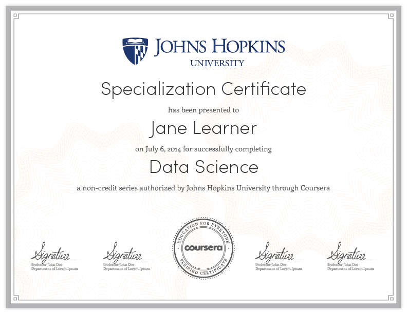

## Alternative title

 How Brian Caffo talked me into a multi-year unpaid Coursera internship. 

---

## How I got into teaching the masses

* __Previously__ : Youtube lectures and “flipping” the classroom.
* __7-1-2012__: Brian tells me Hopkins has a deal with Coursera 
* __7-1-2012__: Roger walks by my office and I tell him he’s in
* __7-2-2012__: Roger and I sign up
* __7-5-2012__: Roger and I make our advertising videos
* __7-17-2012__: Official announcement by JHU
* __9/2012__: – Roger’s/Brian’s courses run
* __1/2013__: – Jeff’s course runs

---

## JHU's announcement

---

## The next day

---

## The day after that

---

## Uh-oh

---

## Roger is so supportive

---
## Johns Hopkins Biostat Coursera classes
### Original three
* Brian Caffo, Roger Peng, Jeff Leek
* Run 09/2012, 09/2012, 01/2013

---
## Enrollments by class and offering
<iframe src="../fig/classPlot2.html" width=100%, height=600></iframe>

---
## Statements of accomplishment by offering
<iframe src="../fig/classPlot3.html" width=100%, height=600 ></iframe>

---
## Over time, MBBC 1
<iframe src="../fig/classPlot5.html" width=100%, height=600></iframe>

---
## Signature track

- Verification based on typing patterns (highly unique according to Coursera)
  - Secondary verification via webcams
- Coursera gives student aid
- Revenue distribution via agreement between Coursera and partner institution
- 155 signature track for 20k students in MBBC1 V4
- Much higher retention and completion rates for signature track
- Between 1% and 12% Signature track rate for classes (depending on a variety of factors)
- All of our classes are $49 for sig track

---
## Case studies

---
## Case studies

---
## Case studies

---
## Statistics, big data, data science

---
## Complimentary problems

---
## Johhs Hopkins Data Science Specialization
### Codirected and taught by Roger Peng, Jeff Leek and Brian Caffo

---
## Courses

---
## Specialization certificate

--- &twocol w1:50% w2:50%
## Unique aspects of the program
*** =left
- Completely redesigned stat curriculum
- 9 signature track courses
- 1 capstone project course
- Total cost (modular) $490
  - $49 per sig track for 10 classes

*** =right
- Each class is four weeks
- Quizzes, in video quizzes, programming assignments and peer assessment projects
- Run monthly after initial rollout
- All content open source
- Toolbox, R Programming and Getting and Cleaning Data have all run
(enrollments of 64k, 62k, 34k resp)

--- 
## Platform choices
- Everything done on Coursera
- All programming in R
- All lecture notes done in Slidify (common theme)
- All content open source
- Version control through git and github
- (Students will learn and use git)
- RStudio as an IDE
- knitr for reproducible documents and report writing

---  &twocol w1:50% w2:50%
## Standard and non-standard stat content 
*** =left
- Basic probability and math stat
- Statistical inference
  - Hypothesis tests, confidence intervals, likelihood
  - Brief intro to Bayesian analysis
- Regression and generalized linear models
- Statistical machine learning
- EDA
- Data analysis

*** =right
- Reproducible research, report generation
- Presentations
- Interactive graphics (rCharts, shiny, manipulate, googleVis)
- Data munging, obtaining data
- Programming
- Plotting (ggplot2, rCharts, R base graphics)
- Capstone project

---

## Core team

--- &twocol w1:50% w2:50%
## Plus generous contributions from the

*** =left
- [Department of Biostatistics](http://www.biostat.jhsph.edu)
- [Center for Teaching and Learning](http://www.jhsph.edu/offices-and-services/center-for-teaching-and-learning/)
- [Bloomberg School of Public Health](http://www.jhsph.edu)
- [Johns Hopkins University](http://www.jhu.edu)
- [Coursera](http://coursera.org)
- Steve, Mike, Karen, Sukon

*** =right
- Everyone at CTL
- Everone at Multimedia 
- Team SWIRL
- Lauren and Ethan (Brian's 2013 interns)
- Contributions from github pull requests
- Tolerant families!
- 800 thousand intrepid self learners
